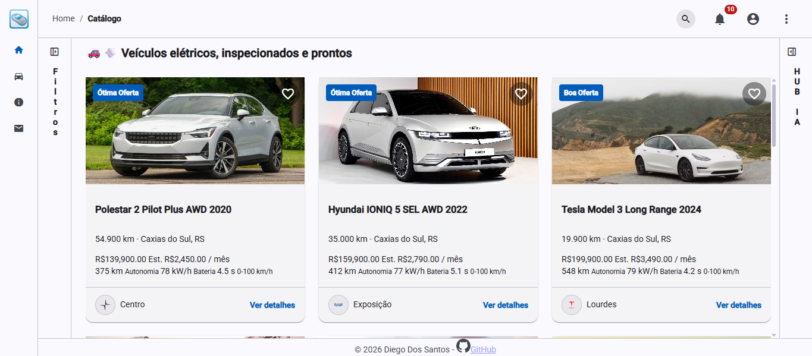
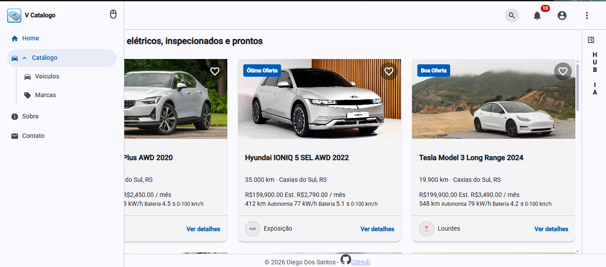
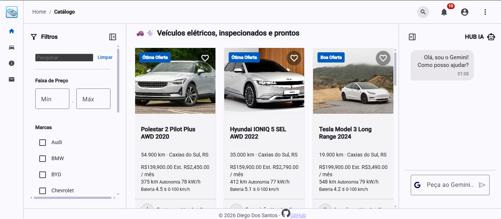
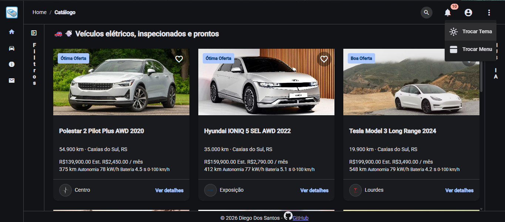
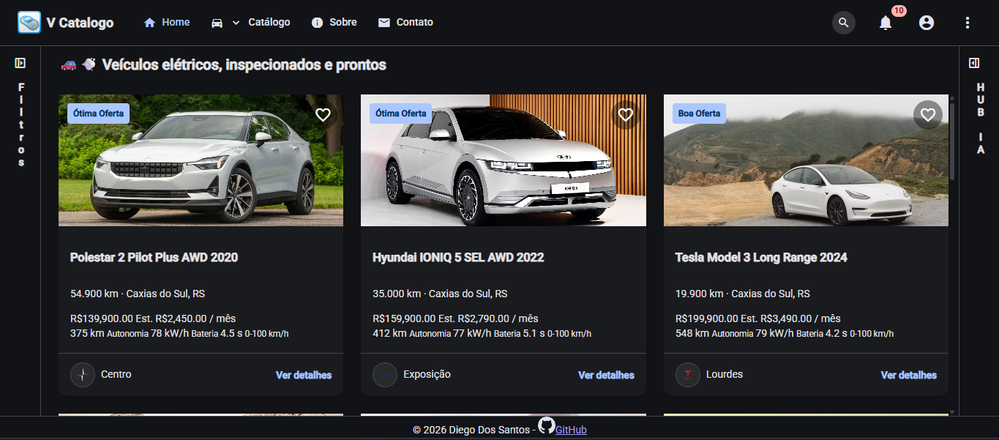
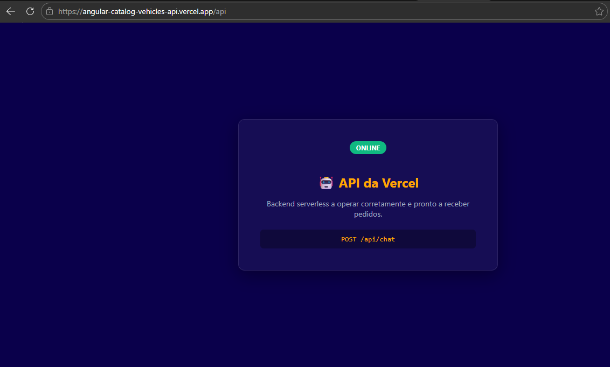

# Angular Catálogo De Veículos

This project was generated using [Angular CLI](https://github.com/angular/angular-cli) version 22.1.6.

Acesse em: https://diegosantos18.github.io/angular-catalog-vehicles/







## Vercel Backend Serverless & Configuração

O projeto conta com funções serverless na Vercel (em `api/chat.ts`) que atuam como intermediárias seguras para provedores de inteligência artificial.



### 1. Variáveis de Ambiente (.env.local)
Crie um arquivo `.env.local` na raiz do projeto com suas credenciais:
```env
GEMINI_API_KEY=sua_chave_gemini
GEMINI_MODEL=gemini-3.5-flash-lite

CHATGPT_API_KEY=SUA_CHAVE_OPENAI
CHATGPT_MODEL=SEU_MODELO_OPENAI

COPILOT_API_KEY=SUA_CHAVE_COPILOT
COPILOT_MODEL=SEU_MODELO_COPILOT
```

### 2. Executando Localmente (vercel dev)
Para rodar e testar o ambiente serverless localmente integrando com o `.env.local`, execute o script configurado no `package.json`:
```bash
npm run vercel-dev
```
O servidor da Vercel será iniciado localmente (geralmente na porta `3000`).

## Development server

To start a local development server, run:

```bash
ng serve
```

Once the server is running, open your browser and navigate to `http://localhost:4200/`. The application will automatically reload whenever you modify any of the source files.

## Code scaffolding

Angular CLI includes powerful code scaffolding tools. To generate a new component, run:

```bash
ng generate component component-name
```

For a complete list of available schematics (such as `components`, `directives`, or `pipes`), run:

```bash
ng generate --help
```

## Building

To build the project run:

```bash
ng build
```

This will compile your project and store the build artifacts in the `dist/` directory. By default, the production build optimizes your application for performance and speed.

## Running unit tests

To execute unit tests with the [Vitest](https://vitest.dev/) test runner, use the following command:

```bash
ng test
```

## Running end-to-end tests

For end-to-end (e2e) testing, run:

```bash
ng e2e
```

Angular CLI does not come with an end-to-end testing framework by default. You can choose one that suits your needs.

## Additional Resources

For more information on using the Angular CLI, including detailed command references, visit the [Angular CLI Overview and Command Reference](https://angular.dev/tools/cli) page.
